# 第1章 初识Spring Boot，开发社区首页


## 1.1 课程介绍


### 1.1.1 简单的需求介绍：

1. **导航栏**
   - 展示网站图标、网站名
   - 首页
   - 消息（可显示消息数）
   - 注册
   - 登录
   - 用户操作（以头像显示的，下拉菜单：个人主页、账号设置、退出登录、展示用户昵称）
   - 搜索栏、搜索按钮

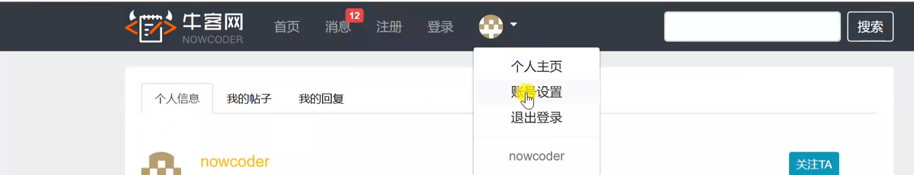


2. **首页**

   - 帖子列表

     - 展示：帖子信息包括：标题、发布者昵称、发布者者头像、发布时间、点赞数、回帖数、是否置顶、是否精华帖

     - 点击某个帖子跳转到对应帖子

     - 列表排序：“最新”、“最热”

     - 发帖（标题、正文）

     - 发帖敏感词过滤、非法词隐藏

     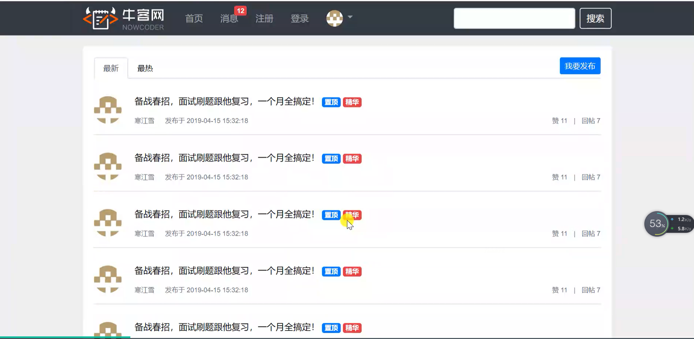

   - 用户鉴权
   
     - 不登录不能发帖、查看消息、查看个人主页、设置账号等
   
   - 帖子主页
   
     - 详细信息：标题、内容、发布者昵称、发布者头像、发布时间、点赞数（点击可点赞）、回帖数
   
     - 回帖列表
   
     - 回帖
   
     - 回帖的回复
   
     - 管理员功能（权限控制）：置顶、加精、删除

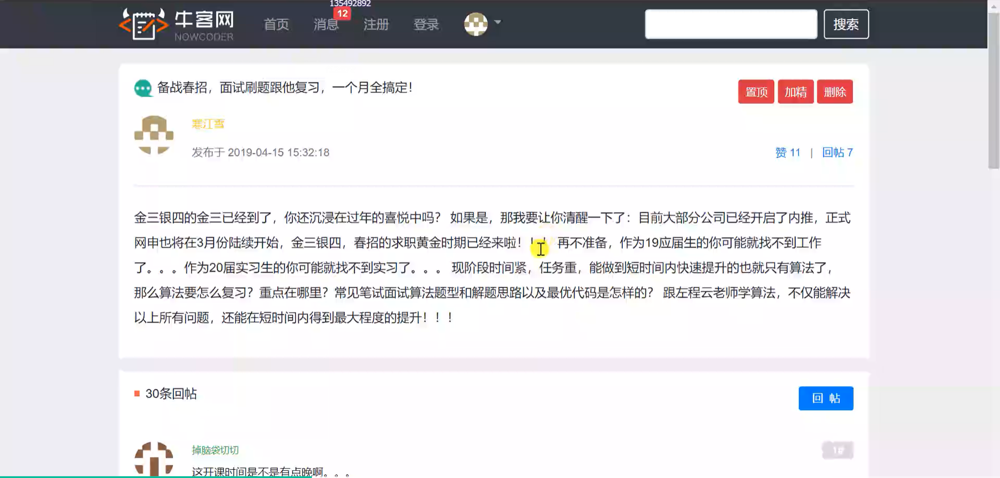

3. **消息**

   - 朋友私信（导航栏显示数量）

     - 私信列表（展示信息：用户昵称、用户头像、最新消息内容、最新消息发送时间、未读消息数、会话总数）

     - “发私信”按钮：填写“朋友”、“内容“两栏信息发送私信给指定朋友

     - 从私信列表点某一私信查看详情

       - 展示：两者所有私信详情（可删除具体某条私信）

       - “TA私信”按钮：给朋友发私信

     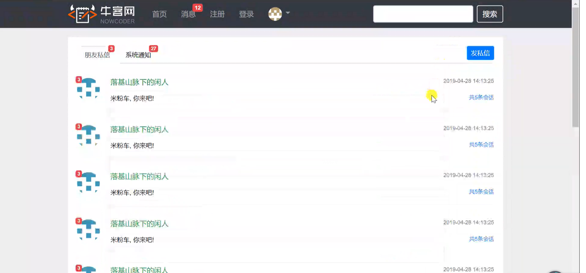

   - 系统通知（导航栏显示数量）

     - 消息种类列表（三类：评论、赞、关注）

     - 每类消息展示信息：种类、对应图标、未读通知数、最新通知内容、最新消息时间、每类消息会话总数

     - 从通知列表点某一通知查看详情

       - 展示：图标、操作用户名、通知内容、通知时间、“点击查看”按钮（跳转到对应页面）

       - 可删除具体某条通知

   *（从截图来看，消息统计数好像有bug？）*

   *注意点：为了降低服务器压力，需要使用消息队列服务器*

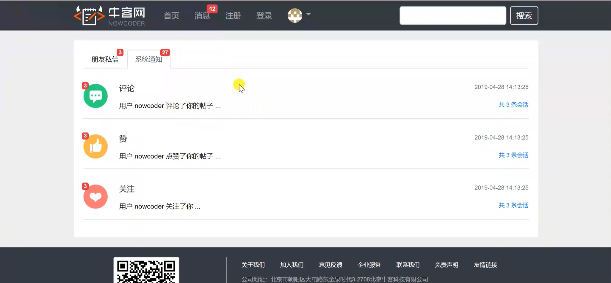

4. **注册**
- 填写基本信息：账号、密码、确认密码、邮箱
   - 给注册邮箱发送激活邮件
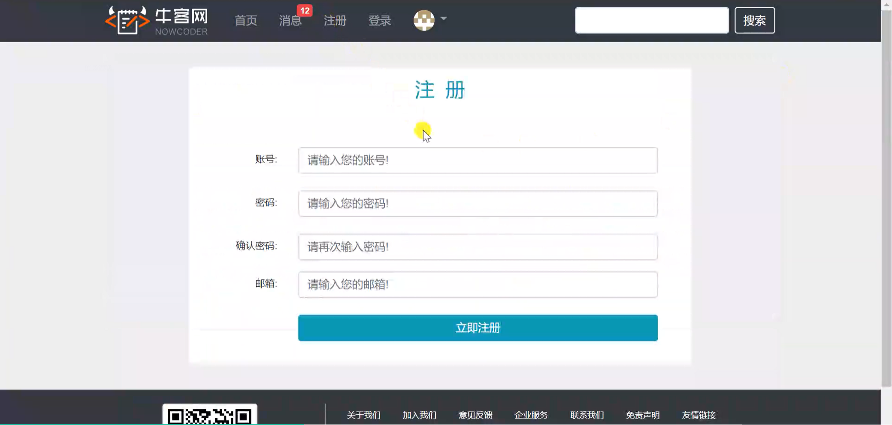


5. **登录**

   - 输入登录必备信息：账号、密码、验证码
   - 页面提供输入合法性检测
     - 账号是否存在
     - 密码长度检测
     - 验证码是否正确
   - 刷新验证码
   - “记住我”选项：勾选后以后自动登录
   - 忘记密码：找回密码？（这节视频里没提到）
   - 登录：后端检测数据，进行登录操作
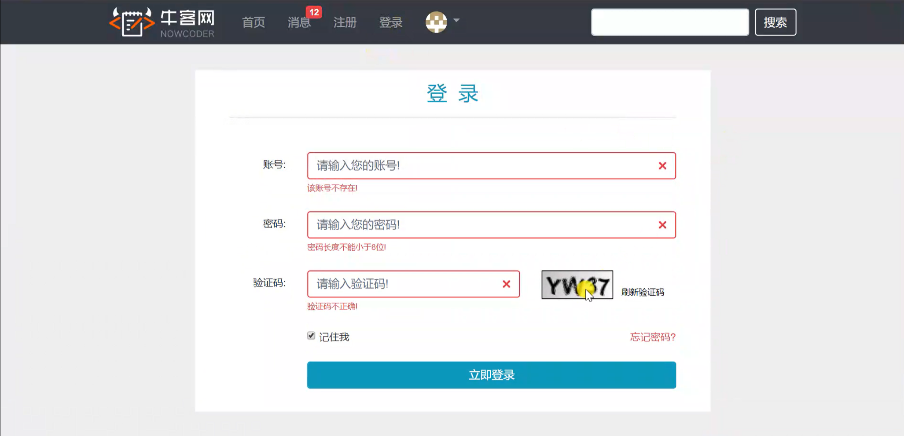

6. **用户操作（下拉菜单）**

   - 个人主页

     - 个人信息

       - 展示信息：昵称、头像、注册时间、关注数、被关注数、获赞数

       - 点击关注数可查看已关注的用户列表

       - 点击被关注数可查看关注自己的用户列表

       - “关注TA”：其他人可点此按钮关注用户
     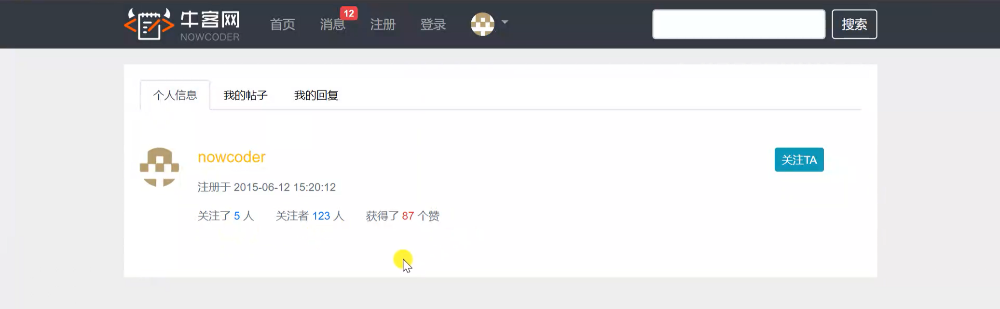

     - 我的帖子

       - 发布的帖子数
       - 帖子列表（展示信息包括标题、内容、发布时间、获赞数）
       - 点击帖子标题可跳转到该帖页面
       - “返回个人主页”：返回到“个人信息”页面
       
       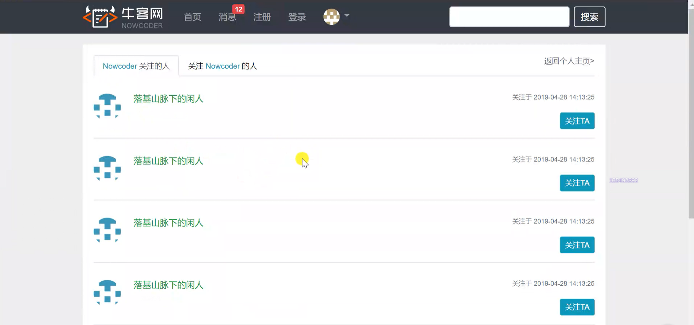
     - 我的回复

       - 回复数

       - 回复列表（展示信息包括标题、回帖内容、回复时间）

       - 点击帖子标题可跳转到该帖页面

       - “返回个人主页”：返回到“个人信息”页面

     *注意点：点赞、关注是较频繁的操作，需要考虑性能问题*
               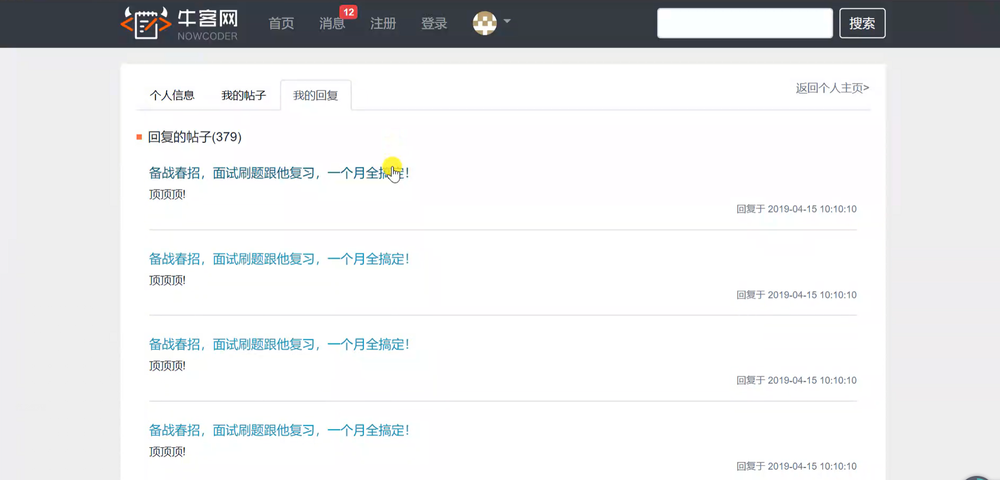

   - 账号设置
     - 上传头像：选择本地图片上传
     - 修改密码：输入原密码与新密码，并再次确认新密码
   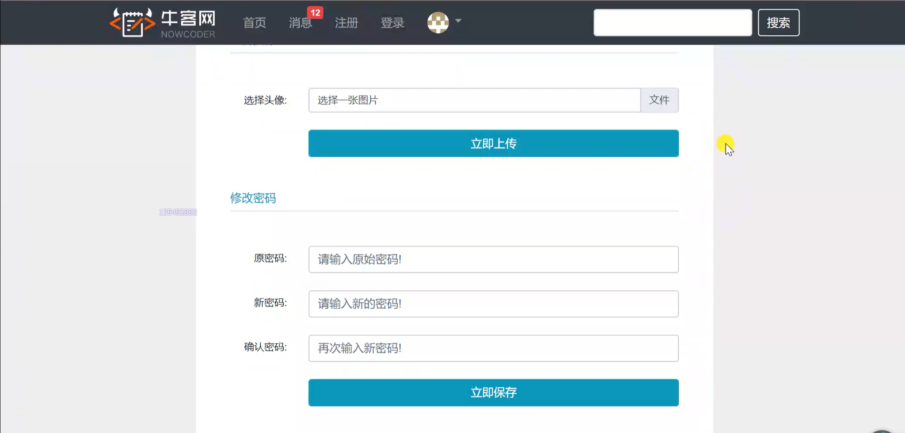
     
   - 退出登录：注销登录

7. 搜索

   - 根据搜索内容查找帖子

   *注意点：需要使用搜索引擎*

   

8. 网站数据统计（隐藏功能，仅支持管理员操作）

   - 网站UV：根据日期范围统计网站UV数
   - 活跃用户：根据日期范围统计活跃用户数
   
   


### 思考

#### 对于需求

1. 导航栏：将“注册”、“登录”与下拉菜单三合一，未登录时“注册/登录”，已登录则只显示下拉菜单
2. 帖子主页的管理员功能三个按钮：只对管理员可见
3. 私信和通知：改好消息统计的bug、增加消息的“已读”操作去掉小红点
4. 朋友私信详情：改为类似聊天框的样子，包括消息显示和发私信
5. 注册：也增加输入合法性检测
6. 登录：还没输入信息时不做合法性检测
7. “关注TA”按钮：对自己的“关注TA”按钮隐藏、对已关注的人显示“已关注”或“相互关注”
8. 管理员：要不要给管理员来一个专门的管理页面？


## 1.2 搭建开发环境

首先肯定得先有 jdk 环境（大于等于 java8 ），这里略过


### 1.2.1 Apache Maven

构建项目、管理项目中的jar包

Maven仓库：

- 本地：~/.m2/repository
- 远程：中央、镜像、私服

官网：https://maven.apache.org


#### 1.2.1.1 Maven安装

1. 打开[官网下载页](https://maven.apache.org/download.cgi)
2. 点击下载 Binary 版（因为只需要使用）
3. 解压
4. 将 bin 目录加到环境变量 Path 中
5. 在 cmd 使用命令 `mvn -version` ，能显示版本信息则安装成功


#### 1.2.1.2 配置镜像（以阿里云为例）

1. 打开[阿里云云效 Maven](https://developer.aliyun.com/mvn/guide)（网页已变，不过输入[视频里的网址](http://maven.aliyun.com)会重定向到该页面）

2. 复制需要的镜像仓库地址（比如 central （中央仓库的镜像）是 `https://maven.aliyun.com/repository/central` ）

3. 打开 `config/settings.xml` 定位到 `</mirrors>` 标签（大概第160行左右），按照文件里给的例子添加

   ```xml
   <mirror>
     <id>aliyunmaven</id>
     <mirrorOf>central</mirrorOf>
     <name>aliyun maven</name>
     <url>https://maven.aliyun.com/repository/central</url>
   </mirror>
   ```


#### 1.2.1.3 Maven入门

> [Maven in 5 Minutes](https://maven.apache.org/guides/getting-started/maven-in-five-minutes.html#)

win环境下需要在 cmd 内操作，在 powershell 下会报错（我也不知道为啥）

1. 查看版本信息

   ```shell
   mvn -version
   ```

2. 进入项目的父目录，创建项目

   ```shell
   mvn archetype:generate -DgroupId=com.mycompany.app -DartifactId=my-app -DarchetypeArtifactId=maven archetype-quickstart -DarchetypeVersion=1.4 -DinteractiveMode=false
   ```

   说明：

   - `archetype:generate` ：以模板原型的方式生成文件
   -  `-DgroupId=com.mycompany.app` ：组织ID
   -  `-DartifactId=my-app` ：项目ID
   -  `-DarchetypeArtifactId=maven-archetype-quickstart` ：模板ID
   -  `-DarchetypeVersion=1.4` ：模板版本
   -  `-DinteractiveMode=false` ：是否启用交互模式（通常设为false，因为参数通常设置好了，不然每次都要问）

   
   项目结构：
   
   
   
3. 编译项目（不会编译测试类）

   ```shell
   cd my-app
   mvn compile
   ```

4. 清理编译的文件（target目录）

   ```shell
   mvn clean
   ```

5. 清理&编译

   ```shell
   mvn clean compile
   ```

6. 清理、编译并进行测试

   ```shell
   mvn clean test
   ```


### 1.2.2 IDEA

打开项目时 import 和 open 的区别：

- open：打开 IDEA 项目
- import：打开 Eclipse 项目，转成 IDEA 


### 1.2.3 Spring Initializr

底层基于 Maven ，可以整合某功能的多个包，引入依赖更方便

打开[Spring Initializr](https://start.spring.io/)，进行配置（这里不知道为啥搜不到 aop 依赖）并下载

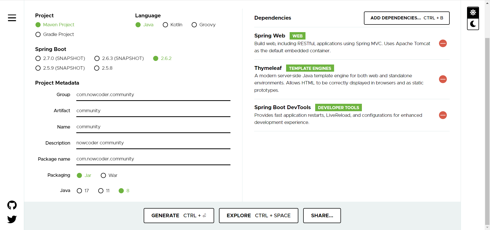


由于没有引入 aop 依赖，所以这里手动引入

打开 IDEA ，根据视频代码在项目的 `pom.xml` 中的 `<dependencies>` 标签中加入依赖：

```xml
<dependency>
	<groupId>org.springframework.boot</groupId>
	<artifactId>spring-boot-starter-aop</artifactId>
</dependency>
```

然后 Maven 进行 Reload 下载对应依赖即可


**可能遇到的错误**

<details>
    <summary>Project 'org.springframework.boot:spring-boot-starter-parent:2.6.2' not found</summary>
    <p><b>原因&解决方法</b></p>
    <p>上网查了下貌似是IDEA的缓存问题，重启了IDEA就行了</p>
</details>

<details>
    <summary>Plugin 'org.springframework.boot:spring-boot-maven-plugin:' not found</summary>
    <p><b>原因</b></p>
    <p>貌似是自动生成的这个没有写具体的版本号</p>
    <p><b>解决方法</b></p>
    <p>查看本地仓库地址（默认为~/.m2/repository，这里具体是~\.m2\repository\org\springframework\boot\spring-boot-maven-plugin），看到有两个不同版本的依赖（2.5.5和2.6.2），于是给这个依赖加上<code>&lt;version&gt;2.6.2&lt;/version&gt;</code>即可</p>
</details>


### 1.2.4 Spring Boot入门示例

#### Spring Boot 核心作用

- 起步依赖：仅使用少量的依赖即可下载大量依赖包
- 自动配置：仅需做很少的配置，甚至可以不做配置
- 端点监控：支持项目上线后对端点进行监控


#### 入门示例：输出“Hello Spring Boot.”字符串

1. 创建 Package ：com.nowcoder.community.controller

2. 在该 Package 下创建 AlphaController ：

   ```java
   package com.nowcoder.community.controller;
   
   import org.springframework.stereotype.Controller;
   import org.springframework.web.bind.annotation.RequestMapping;
   import org.springframework.web.bind.annotation.ResponseBody;
   
   @Controller
   @RequestMapping("/alpha")
   public class AlphaController {
   
       @RequestMapping("/hello")
       @ResponseBody
       public String sayHello(){
           return "Hello Spring Boot.";
       }
   }
   ```

3. 运行项目，访问 http://localhost:8080/alpha/hello

   

#### 简单配置服务器

修改 `application.properties` ：

```properties
# 服务器端口
server.port=8080
# 项目访问路径
server.servlet.context-path=/community
```

重新运行项目，访问 http://localhost:8080/community/alpha/hello

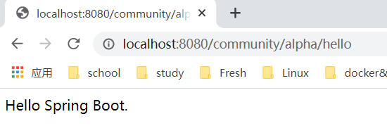

对于修改 .properties 文件的 encoding 的问题：参考 [IntelliJ IDEA设置项目和properties文件编码为UTF-8](https://blog.csdn.net/u012430402/article/details/79633245)

