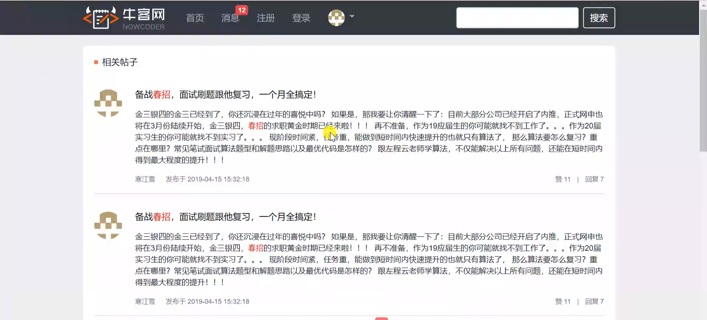

# 第1章 初识Spring Boot，开发社区首页

## 1.1 课程介绍

### 1.1.1 简单的需求介绍：

1. **导航栏**
   - 展示网站图标、网站名
   - 首页
   - 消息（可显示消息数）
   - 注册
   - 登录
   - 用户操作（以头像显示的，下拉菜单：个人主页、账号设置、退出登录、展示用户昵称）
   - 搜索栏、搜索按钮

2. **首页**

   - 帖子列表

     - 展示：帖子信息包括：标题、发布者昵称、发布者者头像、发布时间、点赞数、回帖数、是否置顶、是否精华帖

     - 点击某个帖子跳转到对应帖子

     - 列表排序：“最新”、“最热”

     - 发帖（标题、正文）

     - 发帖敏感词过滤、非法词隐藏

     

   - 用户鉴权
   
     - 不登录不能发帖、查看消息、查看个人主页、设置账号等
   
   - 帖子主页
   
     - 详细信息：标题、内容、发布者昵称、发布者头像、发布时间、点赞数（点击可点赞）、回帖数
   
     - 回帖列表
   
     - 回帖
   
     - 回帖的回复
   
     - 管理员功能（权限控制）：置顶、加精、删除

3. **消息**

   - 朋友私信（导航栏显示数量）

     - 私信列表（展示信息：用户昵称、用户头像、最新消息内容、最新消息发送时间、未读消息数、会话总数）

     - “发私信”按钮：填写“朋友”、“内容“两栏信息发送私信给指定朋友

     - 从私信列表点某一私信查看详情

       - 展示：两者所有私信详情（可删除具体某条私信）

       - “TA私信”按钮：给朋友发私信

     

   - 系统通知（导航栏显示数量）

     - 消息种类列表（三类：评论、赞、关注）

     - 每类消息展示信息：种类、对应图标、未读通知数、最新通知内容、最新消息时间、每类消息会话总数

     - 从通知列表点某一通知查看详情

       - 展示：图标、操作用户名、通知内容、通知时间、“点击查看”按钮（跳转到对应页面）

       - 可删除具体某条通知

   *（从截图来看，消息统计数好像有bug？）*

   *注意点：为了降低服务器压力，需要使用消息队列服务器*

4. **注册**
- 填写基本信息：账号、密码、确认密码、邮箱
   - 给注册邮箱发送激活邮件

5. **登录**

   - 输入登录必备信息：账号、密码、验证码
   - 页面提供输入合法性检测
     - 账号是否存在
     - 密码长度检测
     - 验证码是否正确
   - 刷新验证码
   - “记住我”选项：勾选后以后自动登录
   - 忘记密码：找回密码？（这节视频里没提到）
   - 登录：后端检测数据，进行登录操作

6. **用户操作（下拉菜单）**

   - 个人主页

     - 个人信息

       - 展示信息：昵称、头像、注册时间、关注数、被关注数、获赞数

       - 点击关注数可查看已关注的用户列表

       - 点击被关注数可查看关注自己的用户列表

       - “关注TA”：其他人可点此按钮关注用户
     

     - 我的帖子

       - 发布的帖子数
       - 帖子列表（展示信息包括标题、内容、发布时间、获赞数）
       - 点击帖子标题可跳转到该帖页面
       - “返回个人主页”：返回到“个人信息”页面
       
       
     - 我的回复

       - 回复数

       - 回复列表（展示信息包括标题、回帖内容、回复时间）

       - 点击帖子标题可跳转到该帖页面

       - “返回个人主页”：返回到“个人信息”页面

     *注意点：点赞、关注是较频繁的操作，需要考虑性能问题*
               

   - 账号设置
     - 上传头像：选择本地图片上传
     - 修改密码：输入原密码与新密码，并再次确认新密码
   
     
   - 退出登录：注销登录

7. 搜索

   - 根据搜索内容查找帖子

   *注意点：需要使用搜索引擎*

   

8. 网站数据统计（隐藏功能，仅支持管理员操作）

   - 网站UV：根据日期范围统计网站UV数
   - 活跃用户：根据日期范围统计活跃用户数
   
   

### 思考

#### 对于需求

1. 导航栏：将“注册”、“登录”与下拉菜单三合一，未登录时“注册/登录”，已登录则只显示下拉菜单
2. 帖子主页的管理员功能三个按钮：只对管理员可见
3. 私信和通知：改好消息统计的bug、增加消息的“已读”操作去掉小红点
4. 朋友私信详情：改为类似聊天框的样子，包括消息显示和发私信
5. 注册：也增加输入合法性检测
6. 登录：还没输入信息时不做合法性检测
7. “关注TA”按钮：对自己的“关注TA”按钮隐藏、对已关注的人显示“已关注”或“相互关注”
8. 管理员：要不要给管理员来一个专门的管理页面？

